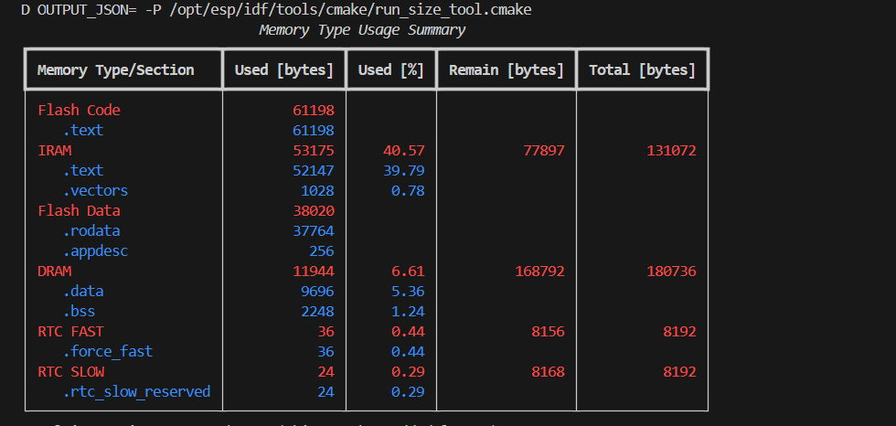
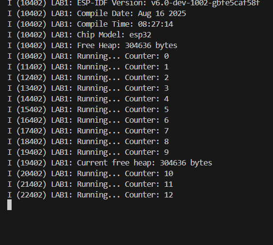

# ดูขนาด binary
idf.py size

# บันทึกภาพตาราง ใส่ในไฟล์ส่งงาน

# ดูรายละเอียดขนาดตาม component
idf.py size-components

# ถ้ามีปัญหาในการดูรายละเอียดขนาดตาม component บนหน้าจอ ให้ใช้คำสั่ง
idf.py size-components > size-components.txt

# แล้วแนบไฟล์ size-components.txt ในโฟลเดอร์ส่งงาน
[text](size-components.txt)
# ดูรายละเอียดขนาดตาม source file
idf.py size-files

# ถ้ามีปัญหาในการดูรายละเอียดขนาดตาม source file บนหน้าจอ ให้ใช้คำสั่ง
idf.py size-files > size-files.txt

# แล้วแนบไฟล์ size-files.txt ในโฟลเดอร์ส่งงาน
[text](size-files.txt)

# บันทึกผลการ simulate ในโฟลเดอร์ส่งงาน
